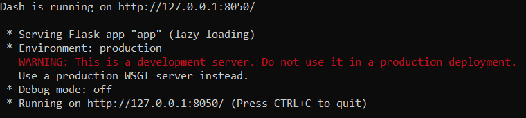
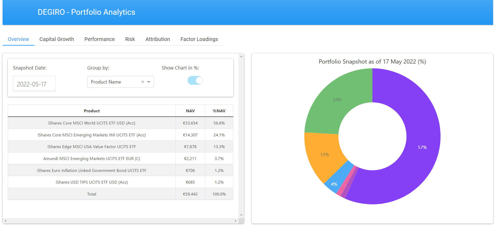
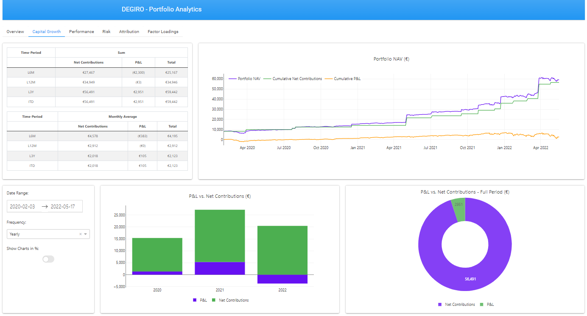
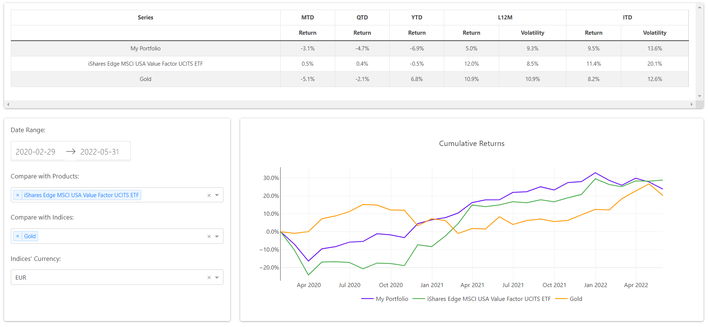
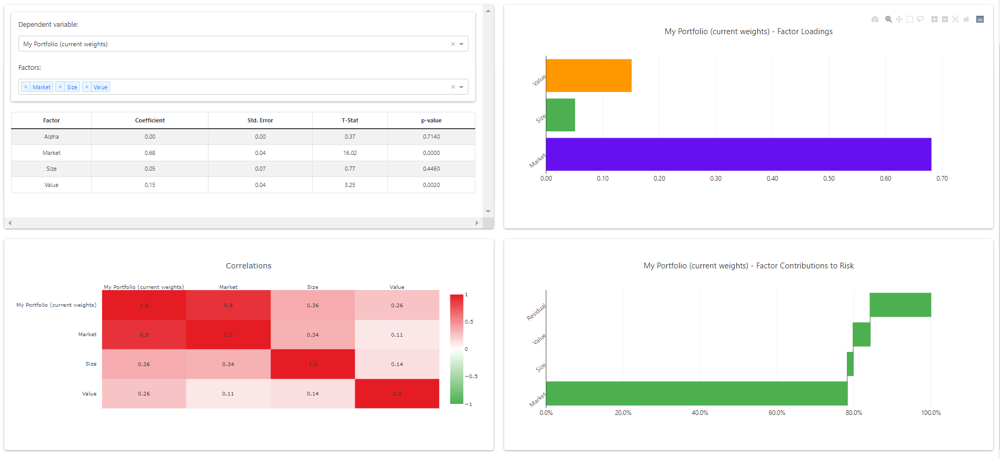

degiro_portfolio_analytics
--------------------------------------------------------------------------------------------------------------------------------------------------------------------------------
--------------------------------------------------------------------------------------------------------------------------------------------------------------------------------
DEGIRO is Europe's fastest growing online stock broker. DEGIRO distinguishes itself from its competitors by offering extremely low trading commissions.
However, the current Portfolio Management/Analytics tools currently available on DEGIRO's platform are extremely minimal and provide little insights into the user's portfolio. 
This repository tries to bridge this gap by:

1. Scraping, retrieving, organizing and storing data from your DEGIRO brokerage account(s) and a variety of publicly available 
   sources. The publicly available data is mainly used for portfolio benchmarking purposes.
2. Providing a web-based dashboard that allows you to get better insights into your portfolio. The dashboard is based on your 
   DEGIRO Portfolio data in addition to a number of publicly available data.

Is this repository for you?
1. You are a european investor, using a DEGIRO brokerage account. All of your holdings are in EUR.
2. You mainly trade ETFs and ETCs and employ a buy and hold strategy.
3. You are not satisfied by DEGIRO basic interface.
4. You want to have better insights about your:
    1. Portfolio Composition
    2. Savings behaviour (e.g. how much are you actually saving and investing each month?)
    3. Capital Growth (e.g. to what extent your portfolio growth is driven by your contributions vs. investment results?)
    4. Portfolio performance (e.g. how well has your portfolio performed over time, compared to a given set of benchmarks?)
    5. Advanced Portfolio Analytics (e.g. what is the risk your portfolio is currently running at?)
    6. Systematic Factor Exposures (e.g. what are the main systematic risk drivers of your portfolio?)
    

## Getting Started
1. Clone the repository:

<code>git clone https://github.com/lucalaringe/degiro_portfolio_analytics.git</code>

2. Install the requirements:

<code>pip install -r requirements.txt</code>

3. Run the data update/download:

<code>python src/run_update.py</code>

4. Run the dashboard:

<code>python src/app.py</code>

5. Once the app is running, copy-paste the link where the app is running into your browser, so to display 
the dashboard. In the example below, the link to copy-paste is: http://127.0.0.1:8050/
   

#### Note
The repository contains a folder named 'data_example'. If you wish to test the dashboard with sample data rather than 
real data coming from your account, please rename the 'data_example' folder into 'data' and run the dashboard:

<code>ren data_example data</code>

<code>python src/app.py</code>

## Dashboard Snapshots by Tab:
### Overview:

### Capital Growth:

### Performance:

### Risk:
.PNG)
.PNG)
### Factor Loadings:

## Disclaimer
I have no affiliation with DEGIRO. This is an unofficial portfolio analytics tool which I personally build to enhance my user experience with the platform and have better control of my finances. I hope many others will find it useful too.
